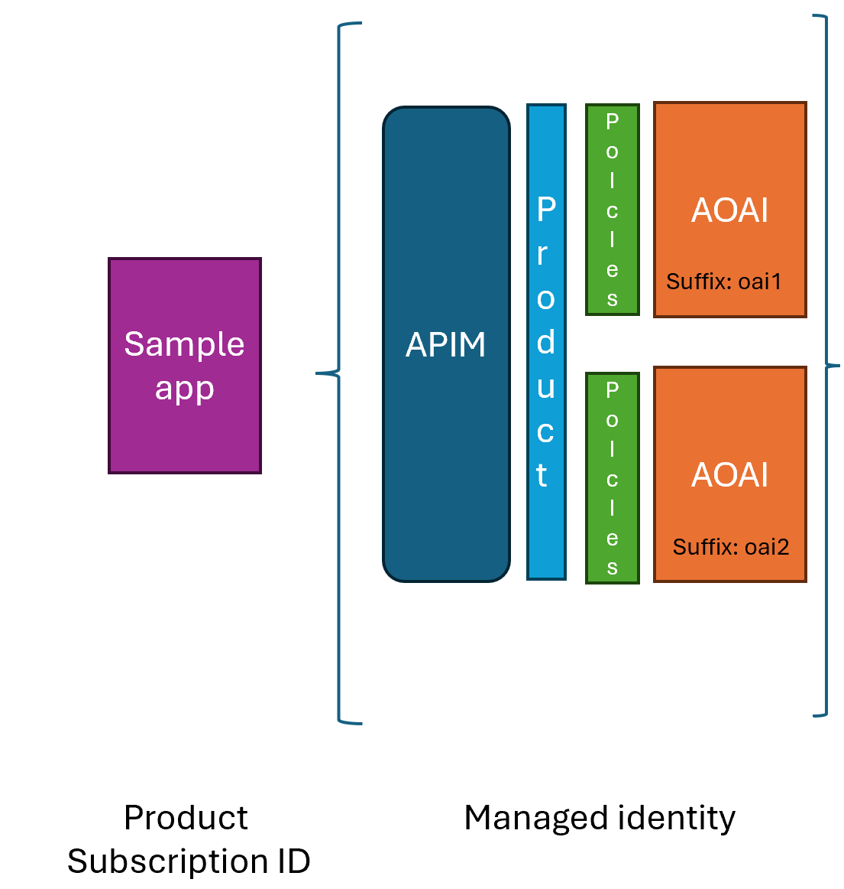
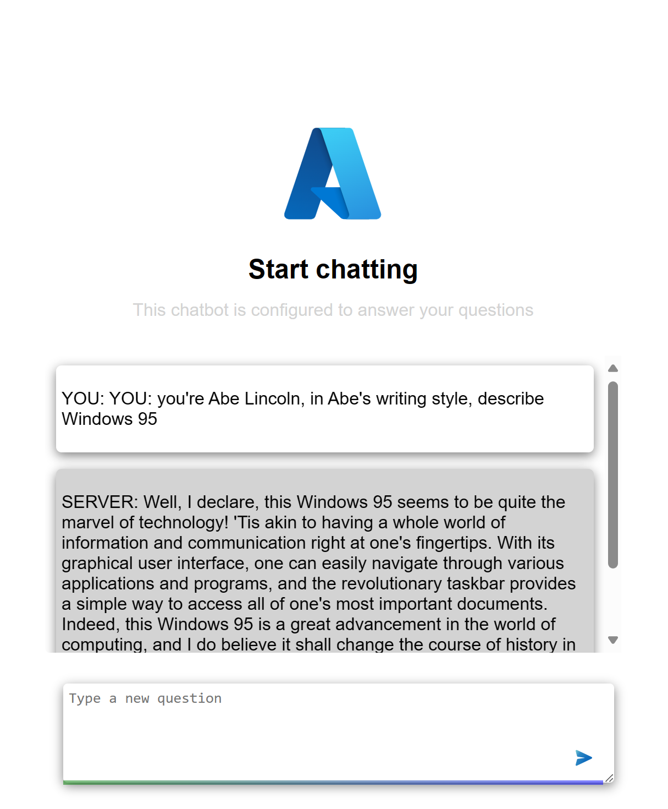

# Azure APIM Azure Open AI sample

This is a sample project that demonstrates how to use Azure API Management and Azure Open AI to create a simple chatbot.

## Cloud resources

This project uses the following Azure resources:

- **Azure API Management**, this is used to manage the Azure Open AI instance and expose it to any consuming clients. API management plays the role of securing the API, managing access, and applying policies to the API.

- **Azure Open AI**, this is the instance of the Azure Open AI API that is used to generate responses to the user's input.

### Bicep

This section describes the Bicep file that are used to deploy the cloud resources, in case you're interested in what gets deployed.

The cloud resources are described using Bicep, Bicep is a Domain Specific Language (DSL) for deploying Azure resources declaratively. 

- Service, the service is the root resource for the APIM instance and looks like so:

    ```bicep
    resource apimService 'Microsoft.ApiManagement/service@2020-06-01-preview' = {
      name: apimServiceName
      location: location
      sku: {
        name: 'Consumption'
        capacity: 0
      }
      properties: {
        publisherEmail: publisherEmail
        publisherName: publisherName
      }
      identity: {
        type: 'SystemAssigned'
      }
      dependsOn: [
        cognitiveServicesAccount
      ]
    }
    ```

    Here, we see that the resource is called `apimService` and it needs the following fields set:

    - **name**, this is the name of the APIM instance.
    - **location**, this is the location of the resource group.
    - **sku**, note how the name is `Consumption` and the capacity is `0`, this is the pricing tier for the APIM instance.
    - **properties**, this is the publisher email and name.
    - **identity**, note how `type` is `SystemAssigned` this creates a managed identity for the APIM instance that we can refer to later when we connect APIM to the Azure Open AI instance.
    - **dependsOn**, this is an array of resources that this resource depends on, in this case, the cognitive services account that needs to be created before the APIM resource.


- API, this is the resource that represents the API/s in the APIM instance and looks like so:

    ```bicep
    resource api 'Microsoft.ApiManagement/service/apis@2020-06-01-preview' = {
      parent: apimService
      name: apiName
      properties: {
        displayName: apiName
        path: apiPath
        protocols: [
          'https'
        ]
        serviceUrl: cognitiveServicesAccount.properties.endpoint
      }
    }
    ```

    The following fields need to be set:

    - **parent**, this is the parent resource, in this case, the APIM instance.
    - **name**, this is the name of the API.
    - **properties**, this is an object that contains the following fields:
        - **displayName**, this is the display name of the API.
        - **path**, this is the path to the API.
        - **protocols**, this is an array of protocols that the API supports.
        - **serviceUrl**, this is the endpoint of the Azure Open AI instance that the API will point to.

    
- Operation, operations can be defined on an API to represent GET, PUT, POST etc. To define an operation you would type the following Bicep:

    ```bicep
    resource operation 'Microsoft.ApiManagement/service/apis/operations@2020-06-01-preview' = {
      parent: api
      name: operationName
      properties: {
        displayName: operationDisplayName
        method: 'POST'
        urlTemplate: '${cognitiveServicesAccount.properties.endpoint}${operationUrlTemplate}'
        responses: []
      }
    }
    ```

    The following fields are defined:
    - **parent**, this is the parent resource, in this case, the API.
    - **name**, this is the name of the operation.
    - **properties**, this is an object that contains the following fields:
        - **displayName**, this is the display name of the operation.
        - **method**, this is the HTTP method of the operation.
        - **urlTemplate**, this is the URL template of the operation.
        - **responses**, this is an array of responses that the operation can return.

- Product, helps expose what APIs are available to developers and looks like so:

    ```bicep
    resource product 'Microsoft.ApiManagement/service/products@2020-06-01-preview' = {
      parent: apimService
      name: productName
      properties: {
        displayName: productName
        subscriptionsLimit: 100
        approvalRequired: false
        subscriptions: [
          {
            displayName: 'Subscription',
            scope: '/apis/${apiName}',
            approvalRequired: false
          }
        ]
      }
    }
    ```

    The following fields are defined:
    - **parent**, this is the parent resource, in this case, the APIM instance.
    - **name**, this is the name of the product.
    - **properties**, this is an object that contains the following fields:
        - **displayName**, this is the display name of the product.
        - **subscriptionsLimit**, this is the limit of subscriptions that can be created for the product.
        - **approvalRequired**, this is a boolean that determines if approval is required for subscriptions.
        - **subscriptions**, this is an array of subscriptions that can be created for the product.
        
- Subscription, this is a subscription to a product and looks like so:

    ```bicep
    resource subscription 'Microsoft.ApiManagement/service/products/subscriptions@2020-06-01-preview' = {
      parent: product
      name: '${apimServiceName}/${productName}/${subscriptionName}'
      properties: {
        scope: '/users/${userId}'
        displayName: subscriptionName
        state: 'active'
      }
    }
    ```

- Policy, TODO

**Authentication**

We've already hinted in places how authentication works in APIM, but let's dive deeper into it. 

- Enable managed identity by setting the `identity` property to `SystemAssigned` in 

    - the APIM instance
    - the Azure Open AI instance
- Create role assignment on the Azure Open AI instance to allow the APIM instance to access the Azure Open AI instance. This involves Bicep looking like so:

    ```bicep
    resource roleAssignment 'Microsoft.Authorization/roleAssignments@2020-04-01-preview' = {
      name: guid(apimService.id, roleDefinitionId)
      scope: cognitiveServicesAccount
      properties: {
        roleDefinitionId: roleDefinitionId
        principalType: 'ServicePrincipal'
        principalId: apimService.identity.principalId
      }
    }
    ```

    - **principalId**, this is the principal ID of the managed identity of the APIM instance.
    - **scope**, this is the scope of the role assignment, in this case, the Azure Open AI instance.
    - **roleDefinitionId**, this is the role definition ID of the role you want to assign to the APIM instance. It should be a GUID that represents the role you want to assign which in our case is a Cognitive Services User role.

- Add Auth policy to the API in APIM, this means we create a policy that's applied on inbound traffic to the API or a specific operation on the API and looks something like so:

    ```xml
    <authentication-managed-identity resource="https://cognitiveservices.azure.com" output-token-variable-name="managed-id-access-token" ignore-error="false" /> 
    <set-header name="Authorization" exists-action="override"> 
        <value>@("Bearer " + (string)context.Variables["managed-id-access-token"])</value> 
    </set-header> 
    ```

- Create a product and expose the API/s. TODO
- Create a subscription on said product TODO

### Architecture



The architecture is set up in the following way:

- **Sample app**
    - **Frontend** The frontend is a simple HTML page that makes requests to the backend.
    - **The backend** is a Node.js app that serves the frontend and makes requests to the Azure Open AI instance.
- **Azure Open AI**, The Azure Open AI instance is an instance of the Azure Open AI API that is used to generate responses to the user's input.
- **The Azure API Management instance** is used to manage the Azure Open AI instances (2 of them) and expose it to the frontend.
- **Policies** are applied to the API to manage the load between the two Azure Open AI instances.
- **Managed identity** is used to authenticate the Azure API Management instance to the Azure Open AI instances.
- **Product and subscriptions**. When you create a product on the Azure API Management instance, you do so to group APIs. You can then create subscriptions to the product to manage access to the APIs.

### Making a request

A typical APIM URL (assuming it has Azure Open AI APIs set up) looks like this:

```http
https://<apim-name>.azure-api.net/<your-api-suffix>/deployments/${deploymentId}/completions?api-version=${apiVersion}
```

An example HTTP URL could then look like so:

```http
https://my-apim.azure-api.net/openai/deployments/gpt-35-turbo/completions?api-version=2020-05-03
```

To make the actual request, you need to make a POST request to the above URL with the following body:

```json
{
    "prompt": "Once upon a time",
    "max_tokens": 50
}
```

and the following headers:

```http
Content-Type: application/json
Ocp-Apim-Subscription-Key: <Your Subscription Key>
```


## -0- Prerequisites

- [Azure CLI](https://docs.microsoft.com/en-us/cli/azure/install-azure-cli)
- [Node.js](https://nodejs.org/en/download/)

## -1- Deploying the project

To deploy the project run the following commands:

```bash
az login
az account set --subscription <Your Subscription ID>
az group create -n <Your Resource Group Name> -l <Your Resource Group Location>
az deployment group create -f main.bicep -g <Your Resource Group Name>
```

This should deploy the following cloud resources:

- Azure API Management
    - APIM service
    - 2x APIM API
    - Product, exposing the Azure Open AI APIs.
        - Subscription
    - Managed identity between APIM and Azure Open AI instances
    - Policies including:
        - Rate limiting
        - Token metrics
        - Token limit
- 2x Azure Open AI

## -2- Run the project locally

To run requests against the APIM endpoint, you need to set some environment variables namely:

- `SUBSCRIPTION_KEY`, this is the subscription key for the APIM instance.
- `DEPLOYMENT_ID`, this is the deployment ID for the Azure Open AI instance, this is what you named the deployment typically something like `gpt-35-turbo`.
- `API_VERSION`, this is the version of the Azure Open AI API, typically `2020-05-03`, this value should match the version you use in the [Bicep file](./main.bicep).
- `APIM_ENDPOINT`, this is the endpoint for the APIM instance, typically `https://<your-apim-name>.azure-api.net`. This is the endpoint you use to access the APIM instance.
- `API_SUFFIX`, this is the suffix for the API, typically `openai` or what you've chosen to name it when configuring the Azure Open AI instance in APIM. The URL to access the APIM endpoint should look like `https://<your-apim-name>.azure-api.net/<your-api-suffix>`.   

To run this locally, you need to provide the below environment variables, you can do this by creating a `.env` file in the root of the project and setting the values there.

- Set the environment variables in the `.env` file, it should look like this:

    ```bash
    SUBSCRIPTION_KEY="<Your Subscription Key>"
    DEPLOYMENT_ID="<Your Deployment ID>"
    API_VERSION="<Your API Version>"
    APIM_ENDPOINT="<Your APIM Endpoint>"
    API_SUFFIX="<Your API Suffix>"
    ```

    Once you have set the environment variables, you can run the app by running the below commands:

    ```bash
    npm install
    npm start
    ```

    This will start the app on `http://localhost:3000` and the API is available at `http:localhost:5000`.

## What's in this repo

|What  |Description  | Link |
|---------|---------|--|
|Frontend     | a frontend consisting of a `index.html` and `app.js` | [Link](./src/web/)        |
|Backend     | A backend written in Node.js and Express framework | [Link](./src/api/)        |
|Bicep     | Bicep files containing the needed information to deploy resources and configure them as needed        | [Link](./main.bicep) |

## Plan

 - [x] Create the app
 - [x] Integrate app to use subscriber secret and APIM URL.
 - [] Create either ARM or Bicep files
     - [x] create resources for APIM. 
     - [x] create resources for Azure Open AI instance.
     - [x] create API and operation pointing to the Azure Open AI instance.
     - [x] configure APIM to use managed identity.
     - [] create a product and a subscription.
     - [] apply policies to the API to share load between two Azure Open AI instances.

## Demo



## Deploy to Azure

[](https://portal.azure.com/#create/Microsoft.Template/uri/https%3A%2F%2Fraw.githubusercontent.com%2F<YourGitHubUsername>%2F<YourRepositoryName>%2Fmaster%2F<YourBicepFileName>.bicep)